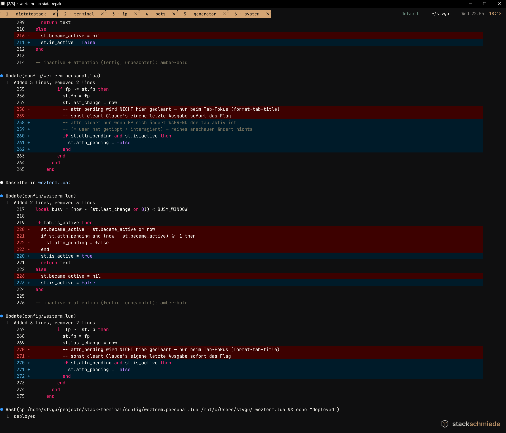

# TerminalStack

**WezTerm-Konfiguration im Stackschmiede-Stil.**
Warme Werkstatt-Palette (Amber + Sage) auf Anthrazit, WSL2-ready, Windows-freundliche Tastenbelegung, intelligente Tab-States (busy / attention / idle).

> by [Stackschmiede](https://stackschmiede.de) · MIT-Lizenz



---

## Features

### Tab-State-Maschine
Jeder Tab hat einen von drei Zuständen, die auf einen Blick erkennbar sind:

| State | Farbe | Bedeutung |
|-------|-------|-----------|
| **Idle** | dunkel / muted | nichts passiert |
| **Busy** | Amber-soft auf Surface | Prozess schreibt gerade Output (letzte 3s) |
| **Attention** | Amber-bold | Prozess hat Bell gesendet — wartet auf dich |
| **Active** | Amber-bold | aktuell fokussierter Tab |

Attention-Marker bleiben stehen bis du *im Tab etwas tippst* — reines Durchtabben zum Überblick löscht sie nicht. Erkennt auch TUIs mit `\r`-Overwrites (Spinner, Streaming-Output wie Claude Code).

### Brand-Design
- Anthrazit-BG (`#0F0F10`), Amber als Primary (`#D4A574`), Sage als Accent (`#6B8E7F`)
- Wordmark-Logo dezent unten rechts im Hintergrund
- Status-Bar mit Workspace, CWD, Datum, Uhrzeit
- Tab-Prefix-Icons je nach Prozess (`◆` Claude, `→` SSH, `▸` Python/Node, `✎` Vim)

### Produktivität
- **Tab-Rename** — `F2` oder `Strg+Umschalt+E`
- **Tab-Cycling** — `Strg+Leertaste` (vorwärts), `` Strg+` `` (rückwärts)
- **File:line Hyperlinks** — `Strg+Klick` auf `path/to/file.py:42` → VS Code an der Zeile
- **Smart-Paste** — `Strg+Umschalt+V` erkennt Bilder in der Zwischenablage, speichert nach `%TEMP%`, fügt WSL-Pfad ein. Läuft gerade `claude` im Tab → automatisches `@`-Prefix für die Claude Code CLI.
- **About-Overlay** — `F1` oder Doppel-Rechtsklick → Brand-Info + Link zu stackschmiede.de
- **Config-Reload** — `F5` (manuell) oder automatisch beim Speichern

### Windows-Integration
- Windows-Style Clipboard (`Strg+C` kopiert bei Selektion, sonst SIGINT, `Strg+V` paste)
- Rechtsklick = Paste
- Shift+Mausrad = seitenweise scrollen, Strg+Mausrad = Font-Zoom
- WSL als Default-Domain — jeder neue Tab startet direkt in WSL

---

## Installation

**Voraussetzung:** Windows 10/11 + WSL2 mit einer Linux-Distro (Ubuntu, Debian, …) + [WezTerm](https://wezfurlong.org/wezterm/)

### Option A · Installer (empfohlen)

1. `TerminalStack-Setup-v*.exe` aus den [Releases](https://github.com/stackschmiede/stack-terminal/releases) laden
2. Doppelklick → Wizard führt durch (WSL-Distro + Username bestätigen/anpassen)
3. Fertig. WezTerm neu starten.

Kein Admin nötig — alles landet im User-Profile.

> **SmartScreen-Warnung:** Der Installer ist noch nicht code-signiert (Zertifikat kostet ~150-450€/Jahr). Beim ersten Start erscheint daher „Der Computer wurde durch Windows geschützt".
> Klicke auf **„Weitere Informationen"** → **„Trotzdem ausführen"**. Das ist bei jedem unbekannten `.exe` so und kein Hinweis auf Schadsoftware. Der Quellcode des Installers ist vollständig im Repo einsehbar (`install/TerminalStack.iss`).

### Option B · Klassisch via Repo / ZIP

```powershell
git clone https://github.com/stackschmiede/stack-terminal.git
cd stack-terminal
.\install\install.bat
```

Doppelklick auf `install\install.bat` öffnet PowerShell und fragt nach:
- WSL-Distribution (Default: erste gefundene)
- WSL-Username (Default: `whoami` in der Distro)
- Projects-Pfad (Default: `/home/<user>/projects`)

Der Installer sichert bestehende Configs als `.bak.TIMESTAMP` und kopiert alles nach `%USERPROFILE%`.

### Option C · CLI / CI

```powershell
.\install\install.ps1 -NonInteractive -WslDistro Ubuntu -WslUsername myuser -Force
```

---

## Deinstallation

Doppelklick auf `install\uninstall.ps1` (oder Rechtsklick → „Mit PowerShell ausführen"). Stellt Backups automatisch wieder her, falls vorhanden.

---

## Shortcuts

### Tabs
| Shortcut | Aktion |
|---|---|
| `Strg+Umschalt+T` / `+N` | Neuer Tab in WSL |
| `Strg+Leertaste` | Nächster Tab |
| `` Strg+` `` | Vorheriger Tab |
| `F2` / `Strg+Umschalt+E` | Tab umbenennen |
| `Strg+Umschalt+Bild↑` / `↓` | Tab verschieben |
| `F6` | Tab in eigenes Fenster detachen |
| `Strg+Umschalt+W` | Tab schließen |

### Panes
| Shortcut | Aktion |
|---|---|
| `Strg+Umschalt+D` / `+R` | Pane horizontal / vertikal splitten |
| `Strg+Umschalt+Alt+Pfeile` | Pane wechseln |
| `Strg+Umschalt+X` | Pane schließen |

### Clipboard & Paste
| Shortcut | Aktion |
|---|---|
| `Strg+C` | Kopieren (wenn Selektion) / SIGINT (sonst) |
| `Strg+V` | Paste |
| `Strg+Umschalt+V` | Smart-Paste (Bild → WSL-Pfad, sonst Text) |
| `Strg+Umschalt+C` | Paste-Only (kein SIGINT-Fallback) |
| Rechtsklick | Paste |

### System & Navigation
| Shortcut | Aktion |
|---|---|
| `F1` / Doppel-Rechtsklick | About-Overlay |
| `F5` | Config neu laden |
| `Strg+Umschalt+L` | Launcher (Projekte aus Launch-Menu) |
| `Strg+Umschalt+O` | Workspace-Switcher |
| `Strg+Umschalt+F` | Scrollback durchsuchen |
| `Strg+Umschalt+Leer` | Quick Select |

### Scrollback & Zoom
| Shortcut | Aktion |
|---|---|
| `Shift+Mausrad` / `Shift+Bild↑↓` | Seitenweise scrollen |
| `Strg+Mausrad` / `Strg+=/−/0` | Font-Zoom |
| `Strg+Klick` auf `file:line` | in VS Code öffnen |

---

## Anpassung

Nach der Installation editierst du `%USERPROFILE%\.wezterm.lua` direkt — WezTerm lädt Änderungen live nach (oder `F5` für manuellen Reload).

Typische Anpassungen:
- Launch-Menu mit eigenen Projekten füllen
- Farben in der `ss`-Tabelle oben tauschen
- Font-Size / Line-Height anpassen
- Busy-Schwelle via `BUSY_WINDOW` (Default: 3s)

Details: [`docs/customization.md`](docs/customization.md).

---

## Projektstruktur

```
stack-terminal/
├── config/
│   ├── wezterm.lua           — Template mit Platzhaltern
│   └── assets/               — Logo-Dateien (Wordmark, Icon)
├── install/
│   ├── TerminalStack.iss     — Inno Setup Skript
│   ├── install.ps1           — PowerShell-Installer
│   ├── install.bat           — Doppelklick-Wrapper
│   ├── uninstall.ps1         — Restore / Cleanup
│   ├── paste-image.ps1       — Smart-Paste Helper
│   └── wizard-*.png          — Branded Wizard-Bilder
├── .github/
│   └── workflows/release.yml — Auto-Build bei Git-Tag
├── docs/
│   └── customization.md
└── preview/                  — Screenshots
```

---

## Release bauen

```bash
git tag v0.1.1
git push --tags
```

GitHub Actions baut automatisch `TerminalStack-Setup-v0.1.1.exe` + ZIP und erstellt ein Release.

---

## Credits

- **Brand & Config** · [Stackschmiede](https://stackschmiede.de)
- **Terminal-Emulator** · [WezTerm](https://wezfurlong.org/wezterm/) von Wez Furlong
- **Fonts** · [JetBrains Mono](https://www.jetbrains.com/mono/), [Inter](https://rsms.me/inter/)
- **Installer** · [Inno Setup](https://jrsoftware.org/isinfo.php) von Jordan Russell

---

## Lizenz

MIT — siehe [`LICENSE`](LICENSE). Logo und Wordmark „Stackschmiede" sind Markenzeichen und nicht durch die MIT-Lizenz abgedeckt; für eigene Forks bitte eigenes Wordmark verwenden.
